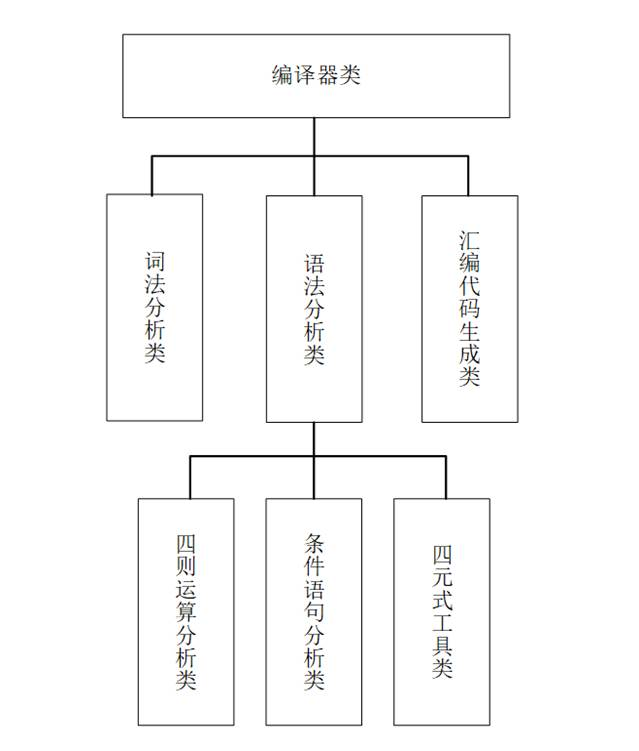
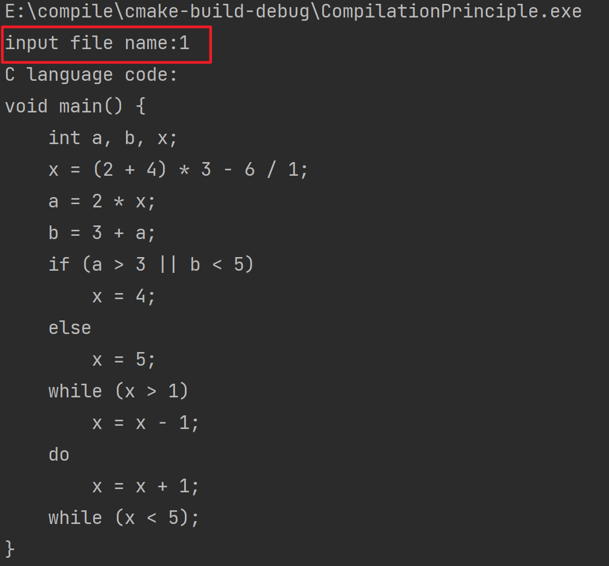
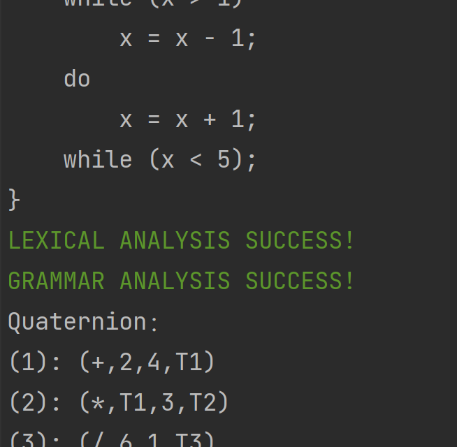
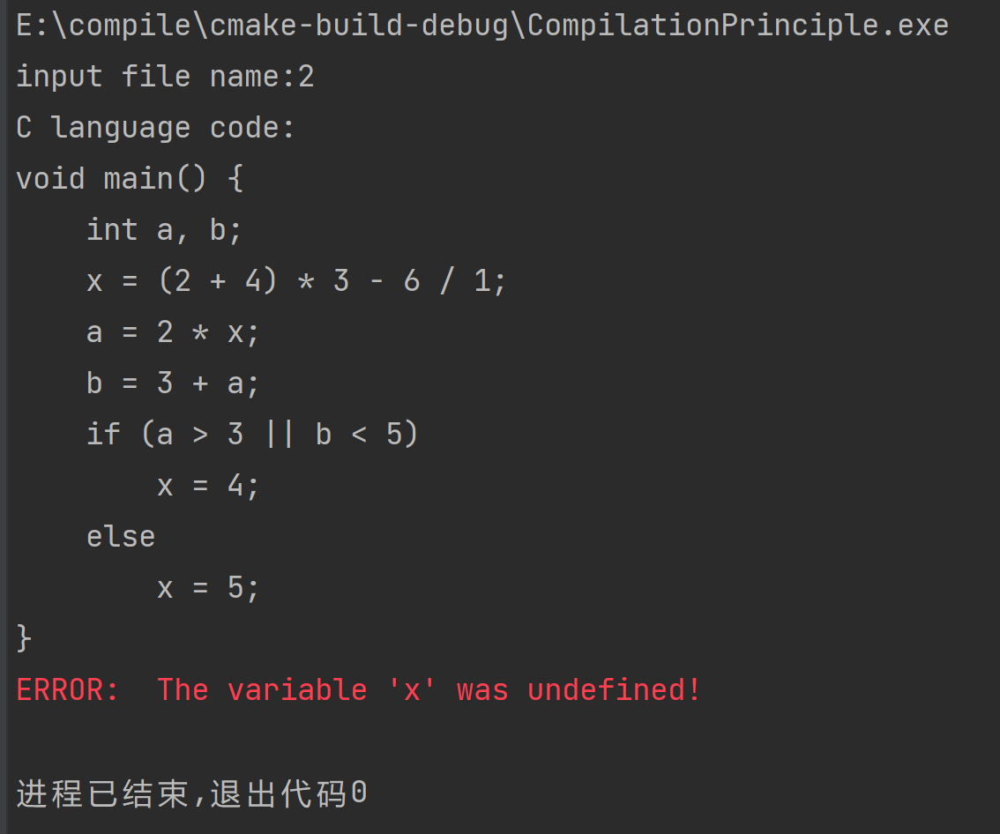
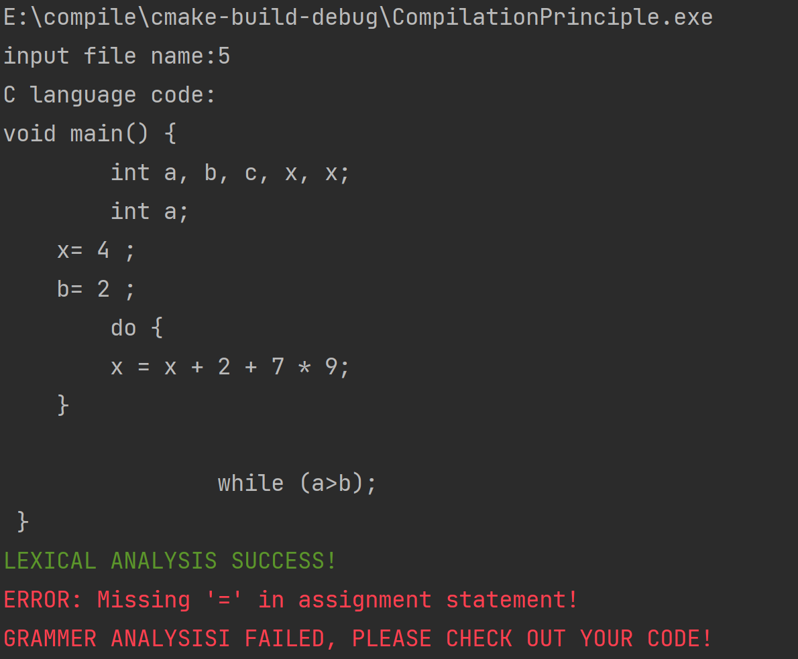

# 一个简易的C语言编译程序

## 概述

该编译程序实现将高级语言源程序（C语言）编译成中间代码四元式和汇编语言程序。实现赋值语句，if语句，while语句，do…while语句以及复合语句的编译。

能做到：

① 词法分析部分：实现对某语言中的源程序单词进行词法分析并能报告出错信息。

② 语法分析部分：实现对某语言中的源程序进行语法分析并能报告出错信息。

③ 中间代码生成部分：实现将某语言中的源程序翻译成中间代码。

④ 目标代码生成部分：实现将某语言中的源程序直接生成目标代码或由中间代码生成目标代码。

## 主要模块功能说明

本程序基于面向对象的思想，实现了一个完整的编译程序类Compiler，下图为具体的模块结构图。

该编译程序类分为三个子类，分别为词法分析类LexicalAnalysis、语法分析类GrammarAnalysis及汇编程序生成类ComBuilder。其中语法分析类下属又有3个子类：四则运算语法分析类OperationAnalysis、条件语句语法分析类ConditionalAnalyzer、四元式工具类Parser。

编译程序类是该程序的主体和入口，是该程序的核心。通过编译程序类产生词法分析类、语法分析类及汇编程序生成类。在该类中，我们可以进行初始化、编译、中间结果及最终结果打印的操作。

词法分析类主要的工作是完成词法分析，通过analyse方法对代码进行词法分析，将代码翻译成程序易于读取的内码，并存入单词表symbolTable中。

语法分析类的主要工作则是分析输入代码的语法是否出错，并将源程序翻译成中间代码四元式。语法分析类采用递归下降分析法，首先读头读入一个单词，如果为变量声明关键字， 则表明这可能是声明语句，开始循环读入直到遇到分号，如果遇到=号则递归调用自身。如果为标识符且下个为=号，则调用四则运算分析类进行处理，并根据分析结果产生相应的四元式。如果读入的是if、while或是do，这表明这后面应该为布尔表达式，调用条件语句语法分析类进行分析，如果语句为结束，则继续调用递归进行分析。

四则运算语法分析和条件语句语法分析采用LR分析法。

在该类中，主要承担的任务是承担编译阶段中间代码生成的大部分功能，通过该类为其他类提供了生成四元式的相关函数，包括findstring——查找单词在单词表中的下标、entry——查变量的符号表入口地址、newtemp——产生一个新的临时变量、gen——产生四元式并填入四元式表、Backpatch——回填过程、Merg——并链。

汇编程序生成类则是将四元式转换成可以编译运行的汇编程序，转换出的汇编程序可直接运行。

## Lovir 改动（2023）

1. 修改读入文件类型(每次都要输入.c好麻烦😭)

2. 语法分析高亮提示及出错中断处理（）

3. 纯英文界面（防撞车）

## Lovir提示

1. 不要给变量赋值0（程序会出错）

1. 不要定义字符'c'为变量（汇编程序无法运行，不过这是masm的问题）

## 开源协议

基于MIT协议开源

